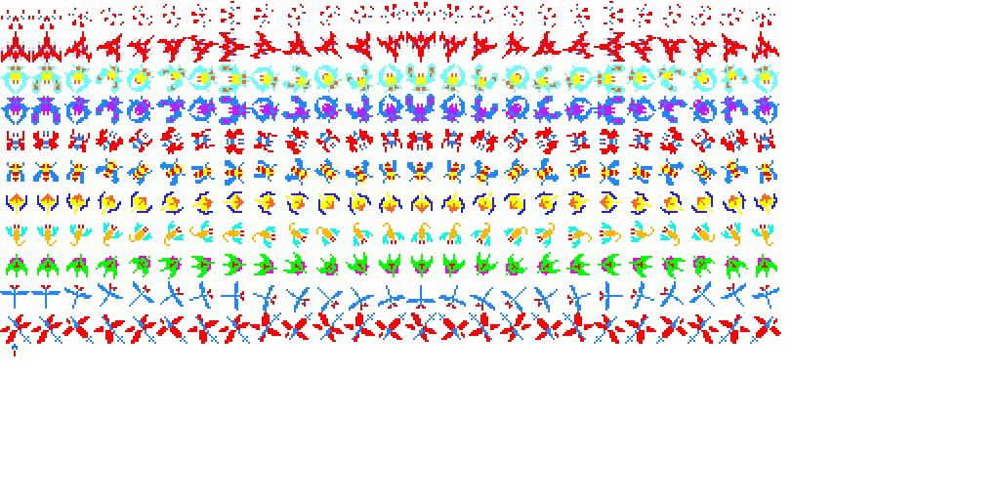

**2DGP 기말 프로젝트 설명**
   
**1. 게임 컨셉 : 갤러그(Galaga) 모작**
  
원게임에 대한 정보    
끊임없이 날아드는 적 편대를 격추시켜야 하는 슈팅게임이다. 
적의 유형에 따라 공격방식이 다르고 시간이 지날수록 강한 적이 등장한다. 
 
**2. 예상 게임 실행 흐름** 
메인신과 인게임신, 스코어신으로 나누어져 있다.
  
**3. 신별 설명**
  
**메인신(타이틀 스테이트)** 
메인신에서는 우주같은 배경에, 게임 시작 전 로고와, 스페이스바를 누르면 게임을 시작한다는 문구를 띄운다. 
스페이스 바를 누르면 인게임신을 푸쉬하여 인게임신으로 진입하고, 이스케이프를 누르면 게임 종료.
  
**인게임신(게임 스테이트)** 
인게임신에서는 메인신과 같은 배경에 적 편대와 플레이어, 발사된 탄환, 현재 점수를 그린다.  	
좌우키를 누르면 플레이어가 좌우로 이동하고 스페이스바를 누르면 탄환 발사, 플레이어가 죽거나 이스케이프를 누르면 스코어신을 푸쉬한다.
  
사용할 객체들의 스프라이트 예시  
 
갤러그 원작의 그래픽 리소스, 사운드 리소스들을 사용할 예정이다.
  
**스코어신** 
플레이어가 죽거나 게임 도중 이스케이프를 누를 경우 점수가 나타난다. 
정확히 죽인 적의 종류와 수가 나오면서 그로 인해 합산된 점수가 나온다. 
여기서 스페이스바를 누르면 팝을 두번하며 메인신으로 이동한다.
  
**4. 개발 일정** 
┌─────────────────────────────────────────────────────────────────────────────── 
│5주차-스테이트, 프레임워크 및 필요한 객체들, 그 객체들의 상호작용 구성(이미 완성)                           
├─────────────────────────────────────────────────────────────────────────────── 
│6주차(개발 시작 기준 1주차)-적 기체 추가, 적 기체와 아군 ,아군 탄환의 충돌 처리(이미 완성)                    
├─────────────────────────────────────────────────────────────────────────────── 
│7,8주차(개발 시작 기준 2,3주차)-적 기체의 다양한 공격 방식 추가1  (베지어 커브를 이용한 곡선 자폭 공격)          
├─────────────────────────────────────────────────────────────────────────────── 
│8,9주차(개발 시작 기준 3,4주차)-적 기체의 공격 방식 추가2 (프랙탈 방식을 이용한 갈라지는 분신 자폭 공격)          
├─────────────────────────────────────────────────────────────────────────────── 
│10,11주차(개발 시작 기준 5,6주차)-스테이지 dict 추가, 리스트에 적 종류별로 몇 마리가 어느 좌표에 있는지 저장      
│※스테이지는 원작 갤러가의 255단계 중에서 따올 예정. 일일이 타이핑 노가다를 해야...                       
├─────────────────────────────────────────────────────────────────────────────── 
│12,13주차(개발 시작 기준 7,8주차)-음원 넣기(그 이후에는 자잘한 피드백 적용)                             
└─────────────────────────────────────────────────────────────────────────────── 
