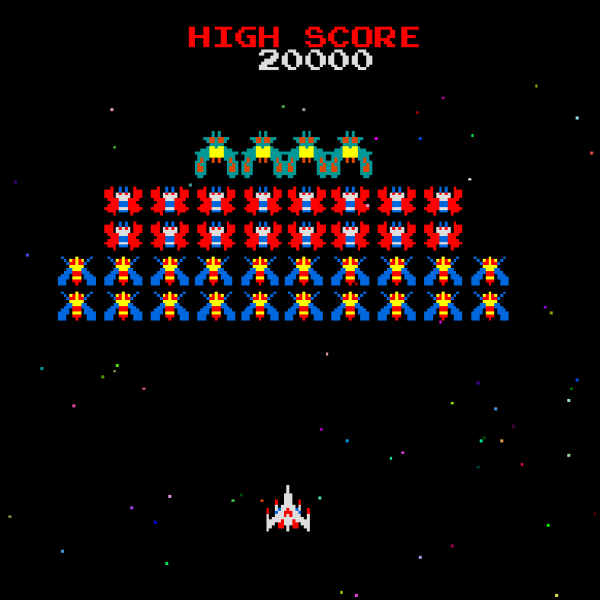

*1. 게임 소개 : 갤러그(Galaga) 모작*
원게임에 대한 정보

끊임없이 날아드는 적 편대를 격추시켜야 하는 슈팅게임이다.
적의 유형에 따라 공격방식이 다르고 시간이 지날수록 강한 적이 등장한다.

*2. 게임신의 종류*
메인신과 인게임신, 스코어신으로 나누어져 있다.

*3. 게임신별 설명*
*메인신*
메인신에서는 우주같은 배경에, 게임 시작 전 로고와, 스페이스바를 누르면 게임을 시작한다는 문구를 띄운다.
스페이스 바를 누르면 인게임신을 푸쉬하여 인게임신으로 진입하고, 이스케이프를 누르면 게임 종료.
*인게임신*
인게임신에서는 메인신과 같은 배경에 적 편대와 플레이어, 발사된 탄환, 현재 점수를 그린다. 
좌우키를 누르면 플레이어가 좌우로 이동하고 스페이스바를 누르면 탄환 발사, 플레이어가 죽거나 이스케이프를 누르면 스코어신을 푸쉬한다.
사용할 객체들의 스프라이트 예시

*스코어신*
플레이어가 죽거나 게임 도중 이스케이프를 누를 경우 점수가 나타난다.
정확히 죽인 적의 종류와 수가 나오면서 그로 인해 합산된 점수가 나온다.
여기서 스페이스바를 누르면 팝을 두번하며 메인신으로 이동한다.

*4. 필요한 기술*
다른 과목에서 배운 기술이랄 건 딱히 없다.
어차피 윈도우 프로그래밍 등에서 배운 방식 자체를 언어만 Python으로 바꿔서 쓰니까.
자료구조에서 배운 스택 자료형조차 이미 본 수업에서 사용법을 알려 주지 않았던가.
앞으로 pico2d에서 쓰는 기능들을 이 과목에서 수업을 통해 추가적으로 알게 될 것으로 기대한다.
예를 들어 음악을 넣는 법이라든지, 혹은 베지어 곡선으로 객체를 포물선 이동시키는 법이라든지.
