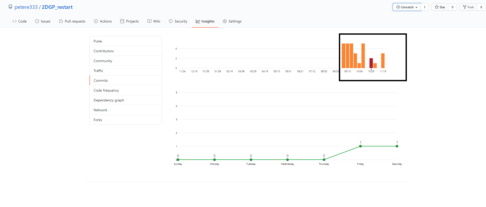
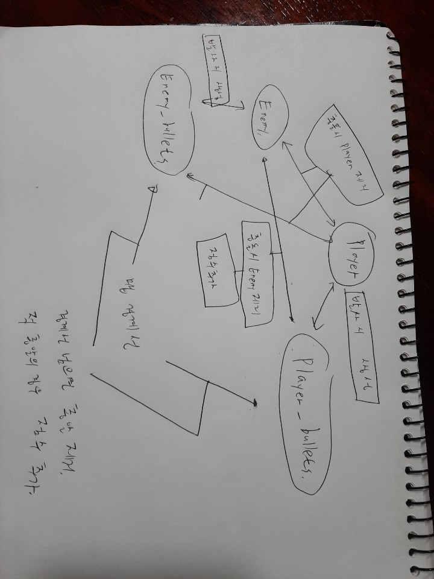

**2DGP 기말 프로젝트 설명**
   
**1. 게임에 대한 간단한 소개 : 갤러그(Galaga) 모작**
  
원게임에 대한 정보    
끊임없이 날아드는 적 편대를 격추시켜야 하는 슈팅게임이다. 
적의 유형에 따라 공격방식이 다르고 시간이 지날수록 강한 적이 등장한다. 
 
**2. 현재까지의 진행 상황** 
전체 100%를 기준으로 각 주차별 내용이 본 프로젝트에 얼마나 중요한지에 따라 비중을 차등있게 두었다. 
현재 80%가량을 완성하였다.
  
┌───────────────────────────────────────────────────────────────────────────────────────────┐ 
│5주차(전체의 25%)-스테이트, 프레임워크 및 필요한 객체들, 그 객체들의 상호작용 구성 // 완성(25%)                   	  	│ 
├───────────────────────────────────────────────────────────────────────────────────────────┤ 
│6주차(전체의 20%)(개발 시작 기준 1주차)-적 기체 추가, 적 기체와 아군 ,아군 탄환의 충돌 처리  // 완성(20%)                	│ 
├───────────────────────────────────────────────────────────────────────────────────────────┤ 
│7,8주차(전체의 15%)(개발 시작 기준 2,3주차)-적 기체의 다양한 공격 방식 추가1  (곡선 자폭 공격)  // 완성(15%)				│ 
├───────────────────────────────────────────────────────────────────────────────────────────┤ 
│8,9주차(전체의 15%)(개발 시작 기준 3,4주차)-적 기체의 공격 방식 추가2 (프랙탈 방식을 이용한 갈라지는 분신 자폭 공격) // 완성(15%)	│ 
├───────────────────────────────────────────────────────────────────────────────────────────┤ 
│10,11주차(전체의 15%)(개발 시작 기준 5,6주차)-스테이지 dict 추가, 리스트에 적 종류별로 몇 마리가 어느 좌표에 있는지 저장       	│ 
│※스테이지는 원작 갤러가의 255단계 중에서 따올 예정. 일일이 타이핑 노가다를 해야...  		// 시험 삼아 2스테이지 완성(5%)   	│ 
├───────────────────────────────────────────────────────────────────────────────────────────┤ 
│12,13주차(잔체의 10%)(개발 시작 기준 7,8주차)-음원 넣기(그 이후에는 자잘한 피드백 적용) 	// 미완 (0%)            		│ 
└───────────────────────────────────────────────────────────────────────────────────────────┘ 

**3. Git-commit 빈도**
 
 
각 주차별로 1회씩 올라왔어야 하지만, 7주차에 8주차의 내용을 모두 수행한 후 연이어 commit하여 9주차의 commit이 없다. 
또한 10주차의 진행 사항 또한 완성했으나 commit하는 것을 잊고 오늘에야 올린다. 

**4. 목표 변경 사항** 
존재하지 않으므로 패스. 

 
**5. 게임 스테이트에서의 게임 오브젝트 클래스 구성 정보** 
Player 구성 요소 = 사진(당연히 있어야 됨), xy좌표, xy가속도(이동용), 마지막에 총알 쏜 타이밍(총알 쏘는 시간 간격 만들기), 
총알 쏘는 시간 간격(0.3초), 충돌하여 죽었는지 여부 
 
Player_bullets 구성 요소=사진(얘도 당연), xy좌표, xy가속도, 부딫쳐서 사라질지 여부(충돌 시 객체 제거), 
 
Enemy 구성요소(공통 사항) = 사진, 타입(스테이지 리스트에서 불러올 값, 1,2,3으로 지정), xy좌표, xy가속도(자폭 시), 마지막 발사 시점, 발사 간격, 
생성된시간, 자폭 타이밍(생성 후 일정 시간 후 자폭), 처치시 주는 점수, 방향(사진 회전에 필요함) 
 
CurveEnemy(곡선으로 돌면서 자폭하는 적) = 구현된 자폭 알고리즘에 필요한 증폭 값(꺾어지는 정도에 비례함) 
DivideEnemy(분신으로 갈라지며 자폭하는 적) = 총알 발사 가능 여부(이미 분신술을 사용했을 경우 총알 발사 안 함), 갈라진 횟수(이미 갈라진 적이 맞추기 어렵고 플레이어와 더 가까이 있으니 점수 많이 줌) 
 
Enemy_bullets 구성 요소 = 사진, xy좌표, xy가속도, 충돌여부, 맵밖으로 나갔는지 여부(나가면 플레이어가 회피한 것이므로 점수 소량 추가) 
 
**6. 게임스테이트에서 게임 오브젝트 간 상호작용** 
 
enemy 모두 제거 시 다음 스테이지 이동
플레이어 제거 시, 혹은 모든 스테이지 클리어 시 남아있는 모든 객체 삭제 및 스코어 스테이트로 이동

**7. 각 게임 오브젝트가 책임지는 내용** 
Enemy 클래스 3종은 기본적으로 적 기체의 이동과 회전, 총알 발사 기능 및 자폭 방식과 시점을 가지고 있다. 
각 적들에 대해 init, update, draw, fire 명령을 내릴 수 있다. 
fire 명령 시 Enemy_bullets 객체를 생성하여 게임공간에 추가한다. 
또한 클래스 외에 Enemy.py 모듕에서는 현재 게임공간에 존재하는 적들과 적 탄환들의 리스트를 가지고 있으므로 현재 존재하는 객체들에 접근할 수 있다. 
그리고 곡선으로 자폭하는 적의 경우 곡선 알고리즘을 구현한 detructCurve 재귀함수가 있다. 
 
Player 클래스는 플레이어의 이동과 총알 발사 기능을 가지고 있다. 
플레이어에게 init, update, draw, fire 명령을 내릴 수 있다. 
fire 명령 시 Player_bullets 객체를 생성하여 게임공간에 추가한다. 
또한 클래스 외에 Player.py 모듈에서는 현재 게임공간에 존재하는 아군 탄환들의 리스트를 가지고 있으므로 이들 객체에 접근할 수 있다. 
 
Enemy_bullets, Player_bullets 클래스는 탄환의 이동과 충돌 여부 판별을 담당한다. 

